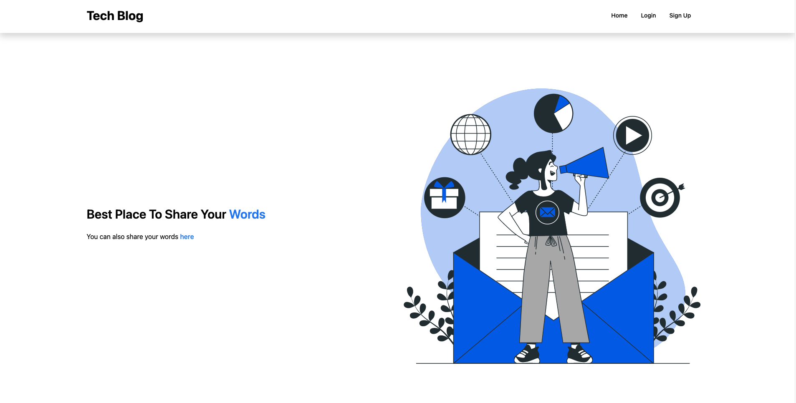

# E-Commerce Backend



## License and Badges


[](https://opensource.org/licenses/MIT)


## Description

This project includes backend and frontend component of tech blog website with route accessing the database and render handlebars.

## Table of Contents

- [Installation](#installation)
- [Usage](#usage)
- [Features](#features)

## Installation

```
mkdir "folderName"
cd "newCreatedFolder"
git init
git clone https://github.com/egemenelz/tech-blog.git

```

## Usage

After opening project with VisualStudio Code

````
npm i - will install all the needed dependecies
nodemon - will start the server
touch .env
    
    DB_NAME = 'database name here'
    DB_USER = 'root'
    DB_PW = 'password'
    SECRET= 'secret here'
    
mysql -u root -p
Enter your password:
    source db/schema.sql

````

## Features

Can use for create contents, update Contents, delete contents, add comment and create new user.

## How to Contribute

For contribution, you can reach me out github.

Any addittional questions, You can reach me at https://github.com/egemenelz

For Full Video -> https://drive.google.com/file/d/1tET68UT-JniQKLfJrIPMeeZvVU9Ep-bP/view
